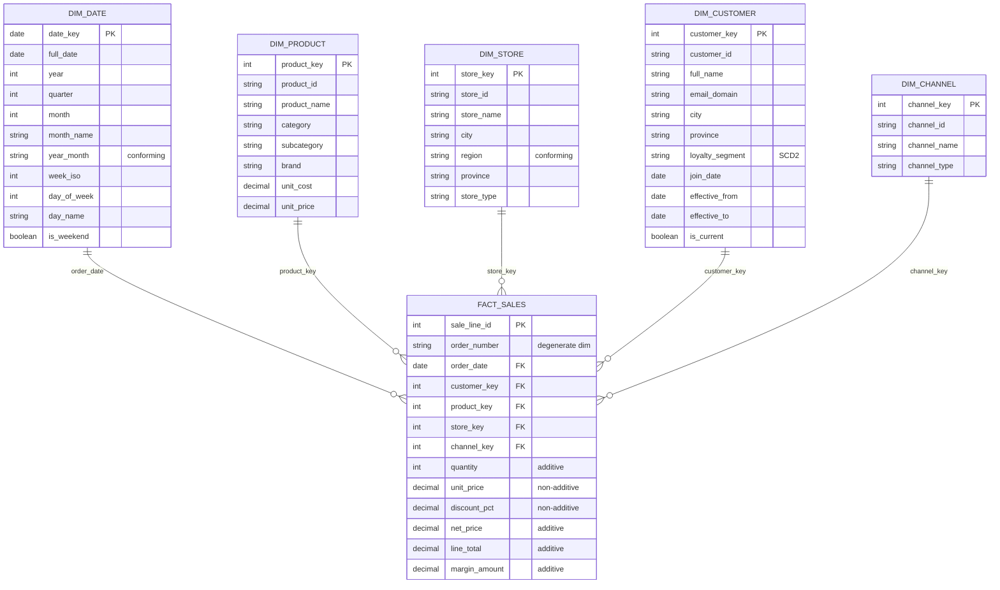

# Schema v1 — NexaMart Star Schema

## Objectif

Ce schema v1 modele le processus principal de vente de NexaMart. Il permet de
repondre de facon repetable a la question CEO :

> Quelles categories de produits declinent dans quelles regions, par trimestre ?

## Grain

**Une ligne de `fact_sales` = une ligne de commande**, identifiee par
`sale_line_id` et contextualisee par `order_number`.

## Tables

| Table | Role | Cle principale |
|---|---|---|
| `fact_sales` | Mesures de vente au grain ligne de commande | `sale_line_id` |
| `dim_date` | Axe temporel | `date_key` |
| `dim_product` | Categorie et attributs produit | `product_key` |
| `dim_store` | Region et attributs magasin | `store_key` |
| `dim_customer` | Client et segment de fidelite | `customer_key` |
| `dim_channel` | Canal de vente | `channel_key` |

## Diagramme Mermaid

Source autonome : `diagrams/schema-v1.mmd`.

## Preuve analytique

La requete `sql/analysis/s02-first-answer.sql` joint `fact_sales` a
`dim_product`, `dim_store` et `dim_date`, puis retourne les ventes par
categorie, region et trimestre avec une lecture de tendance.
