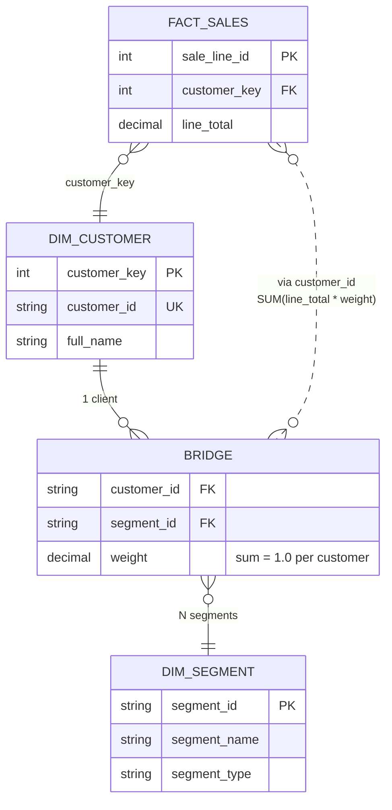

# Bridge tables M:N : une entité, plusieurs rôles, un total juste

Le plus gros piège dimensionnel après SCD2 : représenter une relation
**many-to-many** entre une entité et une dimension sans dédoubler les
chiffres. Ce document le rend visuel.

## Le cas NexaMart

Chaque client appartient à **plusieurs** segments simultanément :

- **Marie Tremblay** est à la fois **Gold** (par valeur), **Fidèle**
  (par comportement), et **Web** (par canal préféré).
- **Jean Roy** n'est que **Silver** (relation 1:1).

On veut répondre : "Revenu par segment, T1 2026". La somme des trois
segments ne doit **jamais** dépasser le revenu total.

## Avant — sans pont (incorrect)

Attacher les segments comme une colonne multi-valuée de `dim_customer`
ne fonctionne pas en SQL. L'alternative naïve est une jointure directe
via une table de liaison **non pondérée**.

```text
dim_customer (3 lignes)          customer_segments (6 lignes)
┌──────────────┬──────────┐      ┌──────────────┬──────────┐
│ customer_key │ full_name│      │ customer_id  │ segment  │
├──────────────┼──────────┤      ├──────────────┼──────────┤
│ 1            │ Marie    │      │ CUS-00042    │ Gold     │
│ 2            │ Jean     │      │ CUS-00042    │ Fidèle   │
│ 3            │ Clara    │      │ CUS-00042    │ Web      │
└──────────────┴──────────┘      │ CUS-00043    │ Silver   │
                                  │ CUS-00044    │ Bronze   │
                                  │ CUS-00044    │ Magasin  │
                                  └──────────────┴──────────┘
```

Si on joint `fact_sales → dim_customer → customer_segments → dim_segment`,
une vente de 100 $ de Marie produit **trois** lignes dans le résultat.
`SUM(line_total)` donne 300 au lieu de 100.

```text
Revenu sans pondération :
  Gold    = 100  ←  compté 1x
  Fidèle  = 100  ←  compté 1x
  Web     = 100  ←  compté 1x
  TOTAL   = 300  ←  FAUX, le vrai total est 100
```

## Après — avec pont pondéré (correct)

On ajoute une colonne `weight` qui somme à 1.0 par client :

```text
bridge_customer_segment (6 lignes, poids = 1.0 par customer_id)
┌──────────────┬──────────┬────────┐
│ customer_id  │ segment  │ weight │
├──────────────┼──────────┼────────┤
│ CUS-00042    │ Gold     │  0.50  │  ┐
│ CUS-00042    │ Fidèle   │  0.30  │  ├─ Marie : 0.50 + 0.30 + 0.20 = 1.0  ✓
│ CUS-00042    │ Web      │  0.20  │  ┘
│ CUS-00043    │ Silver   │  1.00  │  ← Jean  : 1.0                        ✓
│ CUS-00044    │ Bronze   │  0.60  │  ┐
│ CUS-00044    │ Magasin  │  0.40  │  ┴─ Clara : 0.60 + 0.40 = 1.0         ✓
└──────────────┴──────────┴────────┘
```

Le calcul devient `SUM(line_total * weight)` :

```text
Revenu avec pondération (vente de 100 $ de Marie) :
  Gold    =  50  ←  100 * 0.50
  Fidèle  =  30  ←  100 * 0.30
  Web     =  20  ←  100 * 0.20
  TOTAL   = 100  ←  CORRECT
```

## Diagramme de relation



## La règle d'or à retenir

```text
╔═══════════════════════════════════════════════════════════════╗
║                                                               ║
║   SUM(weight) PAR ENTITÉ = 1.0   ← invariant non négociable   ║
║                                                               ║
║   Si violé, la somme des segments ≠ revenu total.             ║
║   Le check validation/checks.sql:test_bridge_weights l'attrape. ║
║                                                               ║
╚═══════════════════════════════════════════════════════════════╝
```

## Trois stratégies de pondération

```text
┌─────────────────┬────────────────────────────────────────────┐
│ Stratégie       │ Formule de weight                          │
├─────────────────┼────────────────────────────────────────────┤
│ Égale           │ 1 / n  (n = nb segments du client)         │
│ Contribution    │ revenu_segment_i / revenu_total_client     │
│ Définie métier  │ Fixée par le board (ex. Gold=.5, …)        │
└─────────────────┴────────────────────────────────────────────┘
```

Choisir **explicitement** dans le brief. Le choix est une décision de
gouvernance, pas un détail technique.

## Check de réconciliation (le seul qui compte)

```sql
SELECT
  (SELECT SUM(line_total)              FROM fact_sales) AS total_sans_pont,
  (SELECT SUM(line_total * b.weight)
   FROM fact_sales f
   JOIN dim_customer c          ON c.customer_key  = f.customer_key
   JOIN bridge_customer_segment b ON b.customer_id = c.customer_id
  )                                                 AS total_avec_pont;
```

Les deux chiffres doivent être **identiques au centime près**. Si ce
n'est pas le cas, soit un client manque dans le pont, soit
`SUM(weight)` s'éloigne de 1.0.

Le worked example complet est dans
`docs/worked-examples/s08-bridge-returns-walkthrough.md`. Le template
SQL est `sql/templates/05_bridge_m2m.sql`.
