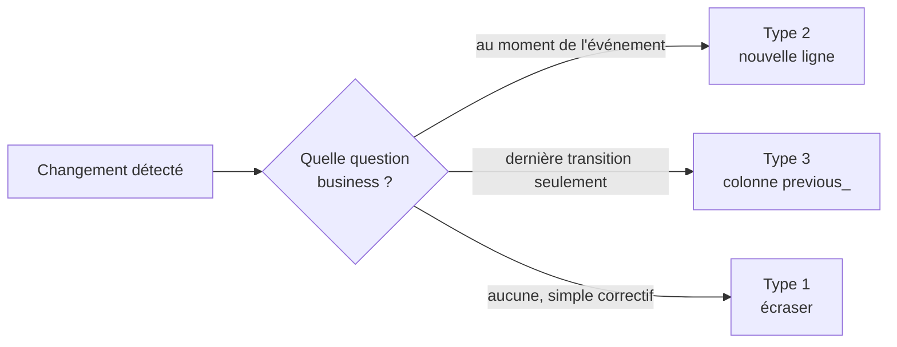

# SCD Type 2 : avant / après

Les *Slowly Changing Dimensions* (SCD) sont le concept qui pose le plus de
difficulté aux étudiants non-programmeurs. Ce document le rend concret
avec un scénario NexaMart et trois versions de la même dimension client.

## Le scénario

Marie Tremblay, cliente `CUS-00042`, habite à Montréal. Son segment de
fidélité est **Silver**. Le 14 juin 2025, elle déménage à Sherbrooke et
monte au segment **Gold** grâce à ses achats récents. Question :

> Un rapport consulté le 1er novembre 2025 doit-il dire que **Marie Tremblay est cliente Gold à Sherbrooke**, ou doit-il pouvoir dire que **les ventes de mars 2025 sont attribuées à Silver à Montréal** ?

La réponse détermine le **type de SCD** que vous choisissez.

## Avant le changement (au 1er juin 2025)

### `dim_customer` minimale

| customer_key | customer_id | full_name | city | loyalty_segment |
|---|---|---|---|---|
| 1 | CUS-00042 | Marie Tremblay | Montréal | Silver |
| 2 | CUS-00043 | Jean Roy | Laval | Bronze |
| 3 | CUS-00044 | Clara Gagnon | Québec | Gold |

### `fact_sales` associée (extrait)

| sale_line_id | customer_key | order_date | line_total |
|---|---|---|---|
| 1001 | 1 | 2025-03-15 | 89.99 |
| 1002 | 1 | 2025-04-22 | 145.00 |

*Au moment de ces ventes, Marie était Silver à Montréal.*

---

## Option A — SCD Type 1 (écraser)

Après le 14 juin 2025, on **met à jour la ligne existante**.

### `dim_customer` après

| customer_key | customer_id | full_name | city | loyalty_segment |
|---|---|---|---|---|
| 1 | CUS-00042 | Marie Tremblay | **Sherbrooke** | **Gold** |

### Rapport à l'automne 2025

> Ventes Silver à Montréal en mars 2025 : **0 $**
> Ventes Gold à Sherbrooke en mars 2025 : **234.99 $**

**Problème.** Les 234.99 $ de mars 2025 sont attribués rétroactivement à
un segment et une ville qui n'existaient pas encore pour Marie à ce
moment-là. L'histoire est réécrite.

**Quand utiliser Type 1.** Corrections de coquille, champ sans valeur
analytique (ex. numéro de téléphone, URL d'avatar), attribut que personne
ne tranche "avant vs après".

---

## Option B — SCD Type 2 (historiser)

On **ferme** la ligne existante et on **ouvre** une nouvelle version.

### `dim_customer` après (avec colonnes SCD2)

| customer_key | customer_id | city | loyalty_segment | effective_from | effective_to | is_current |
|---|---|---|---|---|---|---|
| 1 | CUS-00042 | Montréal | Silver | 2023-04-01 | **2025-06-13** | **0** |
| **10** | CUS-00042 | **Sherbrooke** | **Gold** | **2025-06-14** | 9999-12-31 | **1** |

Observations clés :

- Le **même `customer_id`** (CUS-00042) a maintenant **deux `customer_key`**.
- Les ventes historiques continuent de pointer sur `customer_key = 1`.
- Les nouvelles ventes pointent sur `customer_key = 10`.

### Rapport à l'automne 2025

> Ventes Silver à Montréal en mars 2025 : **234.99 $** ← attribué au bon segment historique
> Ventes Gold à Sherbrooke en août 2025 : **178.50 $** ← nouvelle cliente Gold

**Quand utiliser Type 2.** Attribut analytique que vous voulez pouvoir
filtrer *au moment de l'événement* : segment, région, rôle, catégorie.
C'est le choix par défaut en entrepôt dimensionnel.

---

## Option C — SCD Type 3 (garder les deux)

On ajoute une colonne `previous_*` sur la ligne existante.

### `dim_customer` après

| customer_key | customer_id | city | previous_city | loyalty_segment | previous_segment |
|---|---|---|---|---|---|
| 1 | CUS-00042 | **Sherbrooke** | **Montréal** | **Gold** | **Silver** |

**Avantages.** Permet les rapports "avant/après" simples sans joindre
deux lignes. Une seule ligne par client.

**Limites.** Ne garde que **un** changement. Si Marie change à nouveau
de segment en 2026, `previous_segment` est écrasé et l'histoire
intermédiaire est perdue.

**Quand utiliser Type 3.** Attribut qui change rarement et dont seule la
dernière transition a de la valeur analytique (ex. `previous_role` d'un
employé, `previous_plan_tier` d'un abonnement).

---

## Comment choisir, en une question

```text
Si je dois répondre à "qui était-il au moment de l'événement X", j'ai besoin de :
  - Type 2 pour l'histoire complète
  - Type 3 si une seule transition suffit
  - Type 1 si la question n'existe pas (l'attribut n'a pas de sens historique)
```

## Votre livrable S03

`answers/S03_executive_brief.md` doit :

1. Nommer **un** attribut de `dim_customer` et **justifier** son traitement
   SCD (1, 2 ou 3).
2. Produire un rapport AVANT/APRÈS qui illustre la différence concrète
   (un chiffre qui change selon le type choisi).
3. Expliquer au CEO pourquoi ce choix minimise le risque de décision
   mal informée.

## Diagramme synthétique



Les templates SQL correspondants sont dans
`sql/templates/03_scd_type2.sql` et le check de non-chevauchement des
versions est dans `validation/checks.sql`.
