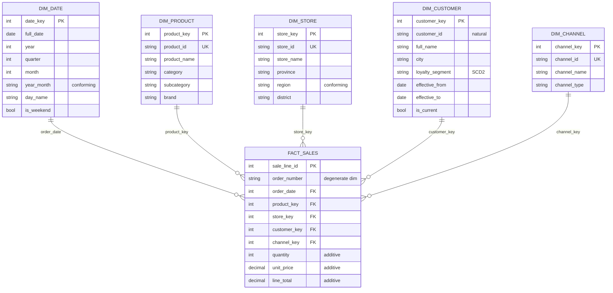

# Schéma en étoile — NexaMart

Le diagramme ci-dessous est rendu automatiquement par GitHub et par
la plupart des éditeurs Markdown (VS Code inclus). Aucun PNG à
maintenir : la source Mermaid est la seule source de vérité.

## Étoile minimale de S02 (`fact_sales` + 5 dimensions)

## Comment lire ce schéma

- **Centre.** `FACT_SALES` contient les mesures (`quantity`, `line_total`) et
  autant de FK que de dimensions interrogées.
- **Branches.** Chaque dimension est une table séparée, reliée par une
  **surrogate key** (`*_key`) — jamais par la clé naturelle (`*_id`).
- **Grain.** Une ligne de `FACT_SALES` = une ligne de commande
  (`order_number` + `sale_line_id`). Le grain est fixé en S02 et ne
  change plus.
- **Dimensions conformes.** `year_month` dans `DIM_DATE` et `region`
  dans `DIM_STORE` sont identifiées comme conformes : elles
  apparaissent avec les **mêmes valeurs** dans toutes les autres fact
  tables (`fact_returns`, `fact_budget`, etc.) et rendent le
  drill-across possible. Voir `docs/visuals/bus-matrix.md`.

## Évolution au fil des séances

Cette étoile grandit. À la fin du trimestre, le même schéma compte
**10 tables de faits** (5 transactions, 2 snapshots, 1 accumulating,
1 factless, 1 bridge) et **7 dimensions** (ajout de `dim_campaign`,
`dim_segment`, et `dim_customer_activity` en mini-dim).

Les autres visuels décomposent chaque pattern :

- `docs/visuals/scd-type2-before-after.md` — comment `DIM_CUSTOMER`
  gère un changement de segment sans réécrire l'histoire.
- `docs/visuals/drill-across-pattern.md` — combiner `FACT_SALES` et
  `FACT_RETURNS` sans gonfler les totaux.
- `docs/visuals/bridge-m2n.md` — quand un client appartient à
  plusieurs segments simultanément.
- `docs/visuals/bus-matrix.md` — grille maîtresse des dimensions
  conformes à travers tous les faits.
- `docs/visuals/promo-exposure-factless.md` — mesurer ce qui s'est
  passé sans colonne numérique.

## Pour aller plus loin

Voir `docs/kimball-cheatsheet.md` pour le vocabulaire et
`docs/worked-examples/s02-star-schema-walkthrough.md` pour le
pas-à-pas de construction.
