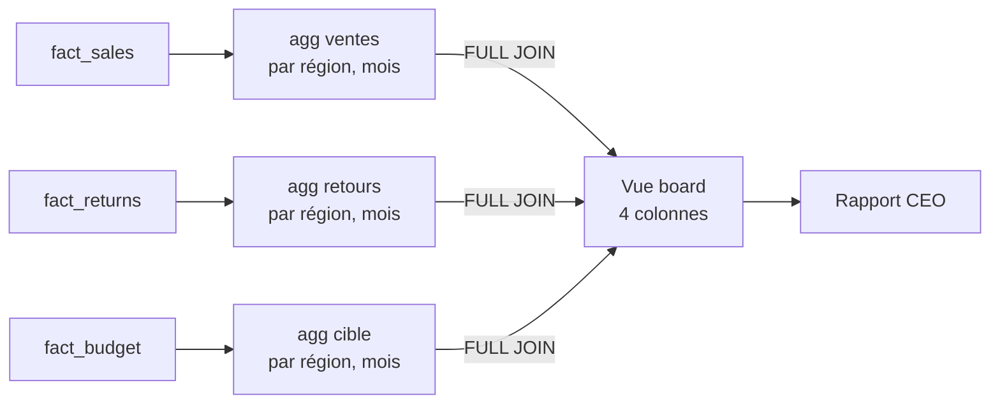

# S06 — Drill-across : réel vs cible sans trahir les chiffres

En S06, NexaMart a **quatre** tables de faits construites dans des
sessions différentes : `fact_sales` (S02), `fact_returns` (S05),
`fact_daily_inventory` (S04) et `fact_budget` (S06). Le board veut une
seule vue. Problème : si vous faites un `JOIN` direct entre deux tables
de faits, **les lignes se multiplient** et les totaux mentent.

La solution s'appelle **drill-across** : agréger chaque fait à un grain
commun, puis joindre sur les **dimensions conformes**.

## La question CEO de S06

> **« Le board peut-il voir ventes, retours, inventaire et budget dans une seule vue sans mentir ? »**

Le mot qui compte : *sans mentir*. Un tableau qui affiche 450 k$ de
ventes quand la somme vraie est 300 k$ est pire que pas de tableau.

## Étape 1 — Comprendre pourquoi un JOIN direct ment

Supposons qu'on veut, par région et par mois : ventes + retours.

Essai naïf :

```sql
-- NE PAS FAIRE
SELECT s.region, d.year_month,
       SUM(f.line_total)        AS ventes,
       SUM(r.refund_amount)     AS retours
FROM fact_sales f
JOIN fact_returns r ON r.order_number = f.order_number   -- un join direct
JOIN dim_store s  ON s.store_key = f.store_key
JOIN dim_date  d  ON d.date_key  = f.order_date
GROUP BY s.region, d.year_month;
```

Un client qui commande **3 lignes** et retourne **2 lignes** fait
apparaître `3 × 2 = 6` lignes dans le produit cartésien. `SUM(line_total)`
est maintenant gonflé d'un facteur 2. Les ventes semblent plus grandes
qu'elles ne sont.

**Règle.** On ne joint jamais deux tables de faits directement. Jamais.

## Étape 2 — Drill-across en trois temps

Le pattern :

1. **Agréger chaque fait séparément** au grain commun (ex. région × mois).
2. **Full outer join** les résultats sur ce grain.
3. Utiliser `COALESCE(…, 0)` pour les combinaisons absentes.

```sql
WITH ventes AS (
    SELECT s.region, d.year_month, SUM(f.line_total) AS revenue
    FROM fact_sales f
    JOIN dim_store s ON s.store_key = f.store_key
    JOIN dim_date  d ON d.date_key  = f.order_date
    GROUP BY s.region, d.year_month
),
retours AS (
    SELECT s.region, d.year_month, SUM(r.refund_amount) AS refunds
    FROM fact_returns r
    JOIN dim_store s ON s.store_key = r.store_key
    JOIN dim_date  d ON d.date_key  = r.return_date
    GROUP BY s.region, d.year_month
),
budget AS (
    SELECT region, year_month, SUM(target_revenue) AS target
    FROM fact_budget
    GROUP BY region, year_month
)
SELECT
    COALESCE(v.region,  r.region,  b.region)       AS region,
    COALESCE(v.year_month, r.year_month, b.year_month) AS year_month,
    COALESCE(v.revenue, 0) AS ventes,
    COALESCE(r.refunds, 0) AS retours,
    COALESCE(b.target,  0) AS cible,
    COALESCE(v.revenue, 0) - COALESCE(r.refunds, 0)  AS net,
    COALESCE(v.revenue, 0) - COALESCE(b.target, 0)   AS ecart_vs_cible
FROM      ventes   v
FULL JOIN retours  r ON r.region = v.region AND r.year_month = v.year_month
FULL JOIN budget   b ON b.region = COALESCE(v.region, r.region)
                     AND b.year_month = COALESCE(v.year_month, r.year_month)
ORDER BY region, year_month;
```

Chaque `SUM` ne voit que son propre fait. Aucun double-comptage. Les
jointures ne se font qu'au grain `(region, year_month)`, qui vient des
**dimensions conformes**.

## Étape 3 — Pourquoi les dimensions conformes rendent ça possible

`dim_store.region` et `dim_date.year_month` sont les **mêmes** colonnes
pour les quatre faits. C'est ce qu'on appelle une dimension conforme :

- Même définition (une région = un regroupement de provinces).
- Même valeur exacte (`'Québec-Est'` s'écrit pareil partout).
- Même granularité au niveau agrégé partagé.

Si `fact_budget` appelait la région `'QC-Est'` et `fact_sales`
`'Québec-Est'`, le `COALESCE(v.region, b.region)` ferait apparaître deux
lignes au lieu d'une. Le test `test_bus_matrix_regions_conforment` dans
`validation/checks.sql` vérifie exactement ça.

## Étape 4 — Cible budget vs réel : interpréter l'écart

```text
region       year_month   ventes   cible    ecart_vs_cible
-----------  -----------  -------  -------  --------------
Québec-Est   2026-01       312k    350k     -38k   ← sous-performance
Québec-Est   2026-02       401k    340k     +61k   ← dépassement
Ontario      2026-01       287k    300k     -13k
```

Lecture business :

- **Négatif** = réel < cible → risque à expliquer.
- **Positif** = réel > cible → opportunité ou cible mal calibrée.
- **Zéro** ne veut pas dire « rien ne s'est passé » ; cela peut aussi
  vouloir dire qu'il n'y a ni vente ni budget (COALESCE sur `NULL`).

Pour l'exécutif, présenter **l'écart absolu ET relatif** :
`ecart_vs_cible / cible * 100` — un dépassement de 61 k$ sur un budget
de 340 k$ représente **+18 %**, pas juste « un gros chiffre ».

## Erreur fréquente à déjouer

### « J'ai fait un JOIN direct, mais j'ai mis DISTINCT, ça va »

**Non.** `SELECT DISTINCT SUM(...)` ne désagglomère rien : les doublons
ont déjà été sommés avant le `DISTINCT`. Si votre requête contient une
seule `FROM` avec deux faits et un `SUM` par-dessus, elle ment. Point.

### « J'agrège d'abord, mais je mets les quatre dans la même CTE »

**Non.** Chaque fait a son propre `GROUP BY`. C'est non négociable.
Une CTE par fait. Le drill-across est une jointure *entre résultats
déjà agrégés*, pas entre faits bruts.

## Diagramme synthétique



## Votre livrable S06

`answers/S06_executive_brief.md` doit :

1. Produire la vue drill-across des **quatre** faits (ventes, retours,
   inventaire, budget) par région × mois.
2. Expliquer **en une phrase** pourquoi un `JOIN` direct entre deux
   faits produirait un chiffre faux.
3. Nommer **une** région où l'écart `ventes - cible` dépasse ±15 % et
   proposer une hypothèse business (pas technique).
4. Lister les **dimensions conformes** utilisées (minimum 2).

Le template SQL de référence est `sql/templates/04_validation_check.sql`
(pour la conformité) ; le pattern drill-across lui-même est spécifique
à S06 et est illustré dans `docs/visuals/drill-across-pattern.md`.
